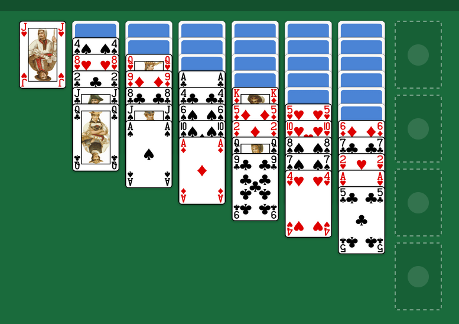

## Yukon Web Solitaire

This is a vibe coded web implementation of the Solitaire game Yukon. It is able to run as a PWA, which means it can be installed locally like an app.
It counts wins and lost games, (refreshing the page counts as loosing) and there is *undo* and *auto* to move cards out of the game.

## License
All files that contains text and/or code except this README are LLM generated, so the usual gray-zone license soup. But for this small kind of toy project, I think MIT is suitable.
The graphics are just copied from Simple Solitaire, and their licenses can be found here:  https://github.com/TobiasBielefeld/Simple-Solitaire/tree/master/pictures/cards
